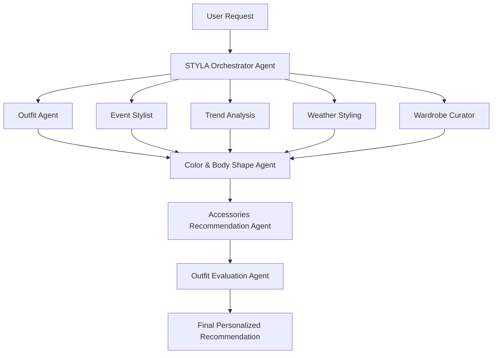
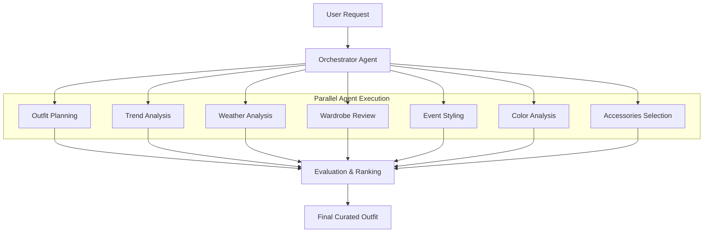

<div align="center">

# 👗 STYLA
### AI Fashion Stylist & Daily Outfit Concierge

*A Multi-Agent Fashion Intelligence System that recommends personalized outfits using AI agents, real-time fashion trends, wardrobe memory, and weather intelligence.*


🏆 **Agents Intensive Capstone Project**

</div>

---

# 📖 Overview

Choosing what to wear every day can be surprisingly difficult.

People often spend unnecessary time deciding outfits for work, college, interviews, dates, parties, or special occasions. They also struggle with matching colors, understanding fashion trends, selecting weather-appropriate clothing, and organizing their wardrobe.

**STYLA** is an AI-powered **Multi-Agent Fashion Intelligence System** that solves these problems through a team of specialized AI agents working together.

Instead of relying on a single AI response, STYLA distributes tasks across multiple intelligent agents, each responsible for one aspect of styling, before combining their outputs into one personalized recommendation.

---

# ✨ Features

- 👗 Daily outfit recommendations
- 🌦️ Weather-aware styling
- 💼 Professional & interview outfits
- 🎉 Party & festive styling
- ❤️ Date-night recommendations
- 👚 Wardrobe organization
- 🎨 Personal color palette suggestions
- 👠 Shoe & accessory recommendations
- 💄 Makeup suggestions
- 🧥 Capsule wardrobe planning
- 🛍️ Shopping recommendations
- 📈 Real-time fashion trend integration
- 🧠 User preference memory
- 🔄 Outfit history to avoid repetition

---

# 🏗 Multi-Agent Architecture



---

# 🤖 AI Agents

## 👗 Outfit Recommendation Agent

Generates personalized daily outfits using wardrobe information, style preferences, fit rules, and color harmony.

---

## 🎉 Event Stylist Agent

Creates occasion-specific outfits for:

- Interviews
- College
- Office
- Parties
- Weddings
- Festivals
- Date Nights

---

## 📈 Trend Analysis Agent

Uses Google Search tools to discover:

- Current fashion trends
- Seasonal styles
- Popular colors
- Celebrity-inspired outfits

---

## 👚 Wardrobe Curator Agent

Maintains wardrobe inventory by:

- Organizing clothing items
- Creating capsule wardrobes
- Detecting wardrobe gaps
- Suggesting future purchases

---

## 🎨 Color & Body Shape Agent

Provides styling recommendations based on:

- Body shape
- Skin tone
- Color palette
- Fabric selection
- Silhouettes

---

## 🌦 Weather Styling Agent

Uses weather information to recommend:

- Suitable fabrics
- Layering
- Temperature-appropriate outfits
- Rain protection
- Seasonal clothing

---

## 💍 Accessories Agent

Completes every outfit using:

- Shoes
- Handbags
- Jewelry
- Watches
- Makeup
- Hairstyles
- Glasses

---

## 🎯 STYLA Orchestrator

Coordinates every agent.

Responsibilities:

- Execute all agents
- Merge outputs
- Evaluate recommendations
- Produce the final outfit

---

# 🧠 AI Engineering Concepts

This project demonstrates several core Agentic AI concepts.

✅ Multi-Agent Systems

✅ Agent Orchestration

✅ Tool Calling

✅ Session Memory

✅ Context Engineering

✅ Long Context Management

✅ Autonomous Planning

✅ AI Decision Making

✅ Agent Evaluation

✅ Modular AI Architecture

---

# 🛠 Tech Stack

| Category | Technology |
|----------|------------|
| Language | Python |
| Framework | Google ADK |
| LLM | Gemini |
| Development | Google AI Studio |
| Notebook | Kaggle |
| Version Control | Git & GitHub |
| APIs | Weather API, Google Search |

---

# ⚙ Workflow



---

# 📂 Repository Structure

```text
STYLA/
│
├── README.md
├── styla-ai-fashion-stylist-daily-outfit-concierge.ipynb
└── LICENSE
```

---

# 💡 Example

### User Input

```text
Event:
College Presentation

Weather:
29°C

Wardrobe:
White Shirt
Beige Trousers
White Sneakers
Black Watch

Preference:
Minimalist
Neutral Colors
```

---

### AI Recommendation

```text
✔ White Oxford Shirt

✔ Beige Straight-Fit Trousers

✔ White Sneakers

✔ Black Leather Watch

✔ Lightweight Cotton Fabric

✔ Hair: Low Ponytail

✔ Minimal Makeup

✔ Confidence Score: 96%
```

---

# 🎯 Project Objectives

- Reduce outfit decision fatigue
- Improve styling confidence
- Personalize fashion recommendations
- Utilize real-time information
- Demonstrate practical Multi-Agent AI engineering

---

# 📚 Learning Outcomes

This project demonstrates practical implementation of:

- Multi-Agent Systems
- Google Agent Development Kit (ADK)
- Agent Orchestration
- AI Memory
- Tool Integration
- Context Engineering
- Prompt Design
- AI Workflow Design

---

# 📸 Kaggle Notebook

👉 https://www.kaggle.com/code/manisanayak/styla

---

# 🚀 Future Improvements

- Mobile Application
- Virtual Try-On
- Image-based Wardrobe Detection
- AI Closet Scanner
- Calendar Integration
- Shopping API Integration
- Fashion Brand Recommendations
- Outfit Image Generation
- Voice Assistant Support

---

# 👩💻 Author

## **Manisa Nayak**

🎓 Student | Full-Stack Developer | AI Product Builder

Passionate about:

- Full-Stack Architecture
- User Experience (UI/UX)
- AI Automation & Product Building

### Connect with Me

**GitHub**
https://github.com/Khushi1310-nayak

**Kaggle**
https://www.kaggle.com/manisanayak

---

## ⭐ If you found this project interesting, consider giving it a Star!
